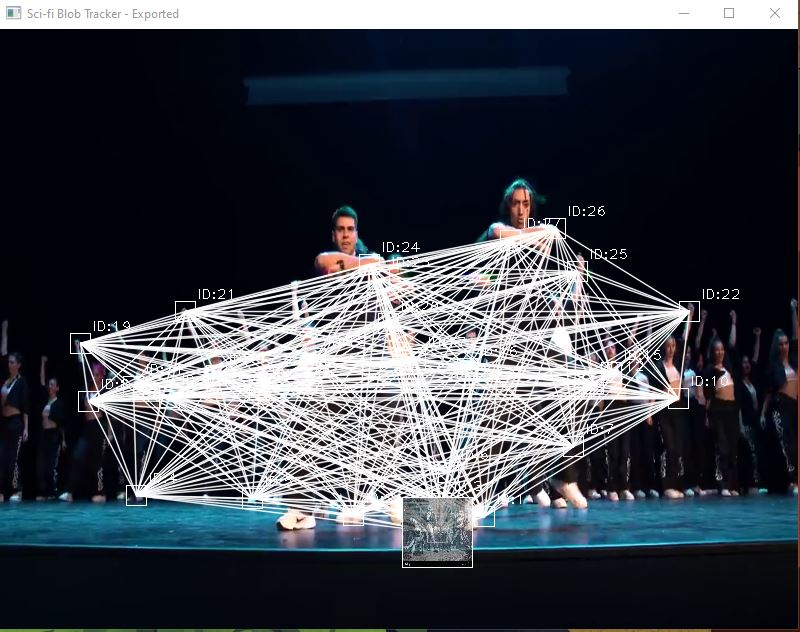
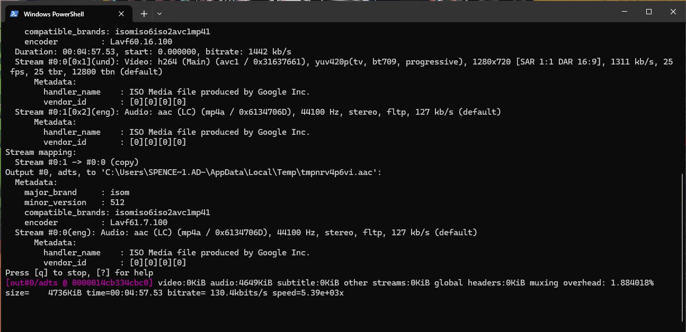
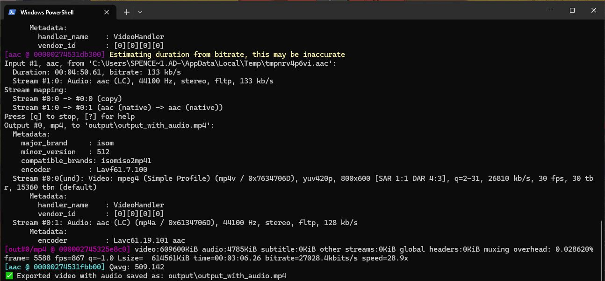

# 🚀 Sci-fi Blob Tracker Video Exporter

A Python-powered sci-fi visual effect tool that tracks motion blobs in videos, applies glitchy RGB effects, overlays images, and exports the result with original audio. Great for creative, AI-inspired content.

---

## 🎟️ Features

- 🔍 Motion-based blob detection using OpenCV
- 💡 Electric cyber-glitch RGB slicing effects
- 📷 Image overlays on detected targets (1.jpg to 8.jpg)
- 🔗 Connective lines and tracked IDs per blob
- 🎥 Export to video with **original audio** via ffmpeg

---

## 🔧 Requirements

- Python 3.7+
- [FFmpeg](https://ffmpeg.org/download.html) installed and in your PATH
- Python packages:

```bash
pip install -r requirements.txt
```

**requirements.txt**
```
numpy
opencv-python
```

---

## 🚡 Project Structure

```
project/
├── input/
│   └── test1.mp4          # Source video file
├── img_e/
│   ├── 1.jpg
│   ├── 2.jpg
│   └── ... (up to 8.jpg)
├── output/
│   └── output_with_audio.mp4   # Final processed video
├── export.py             # Main Python script
├── requirements.txt
└── README.md
```

---

## ⚖️ How It Works

1. Extracts audio from original video
2. Processes each frame:
   - Sharpens + detects motion
   - Detects keypoints (blobs)
   - Applies glitch effects
   - Draws overlays, connections, and images
3. Writes video frames to a temp file
4. Merges original audio using ffmpeg
5. Outputs final video to `/output/output_with_audio.mp4`

---

## 🚀 Run the Script

```bash
python export.py
```

Make sure your video is inside `input/` and your overlay images are inside `img_e/`.

---

## 📸 Screenshots

| Tracker UI | Audio Extraction | Final Output |
|------------|------------------|---------------|
|  |  |  |

---

## 📋 To-Do / Ideas

- [ ] Add config file for easier adjustments
- [ ] Support transparent PNG overlays
- [ ] Add CLI arguments for dynamic input/output
- [ ] Real-time webcam mode

---

## 🚀 License

MIT License. Feel free to use, remix, and enhance for your own sci-fi vision.
